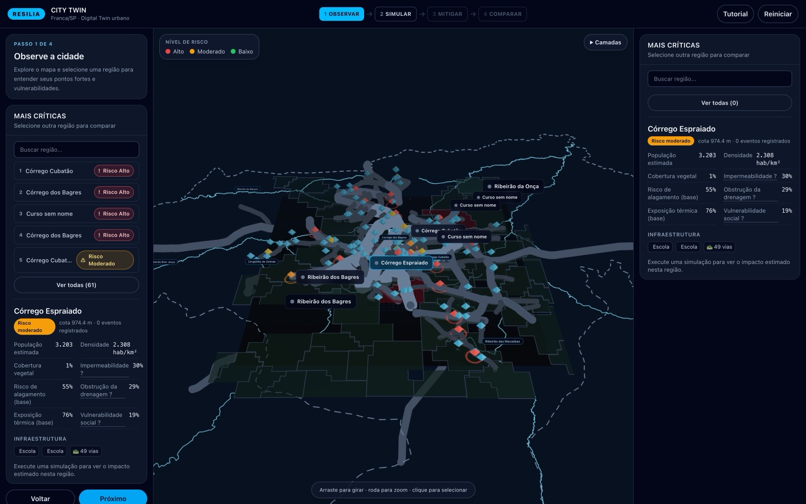
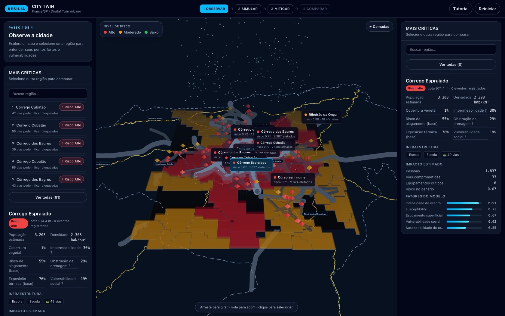
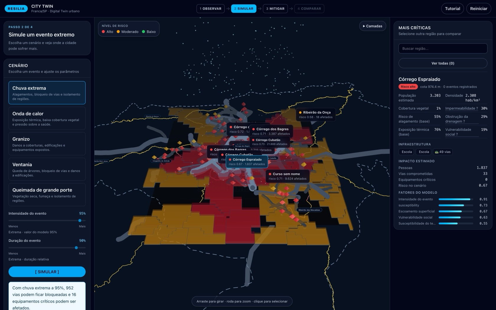
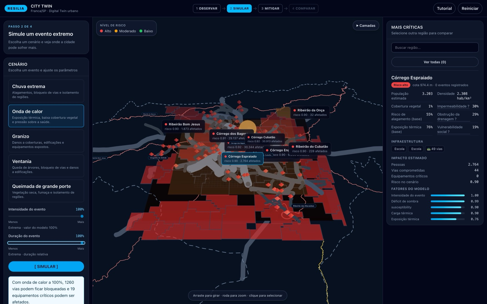
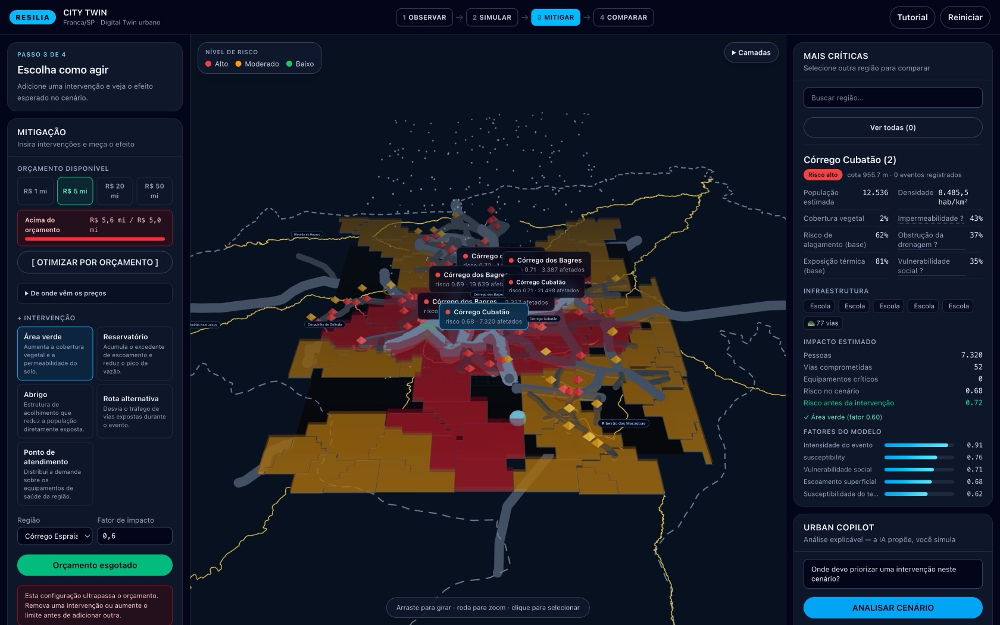
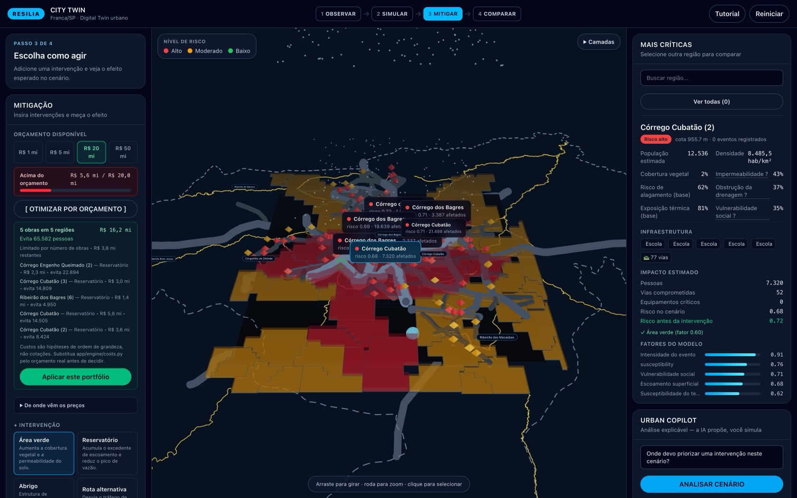
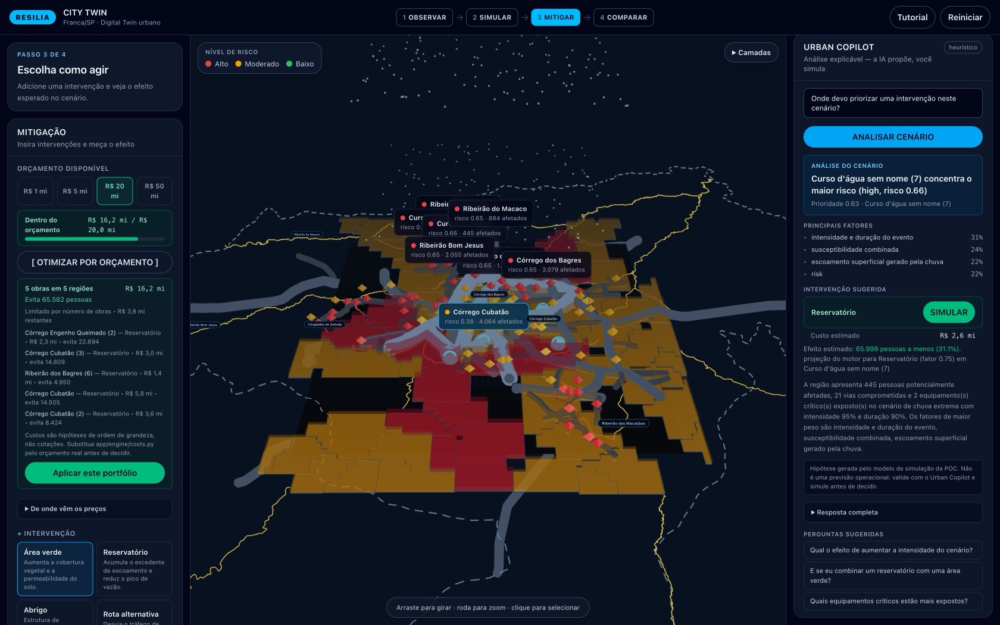
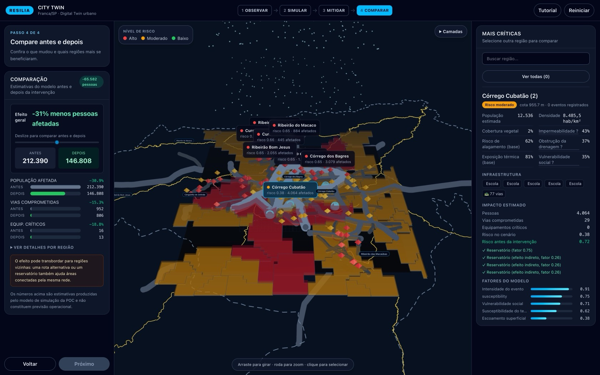
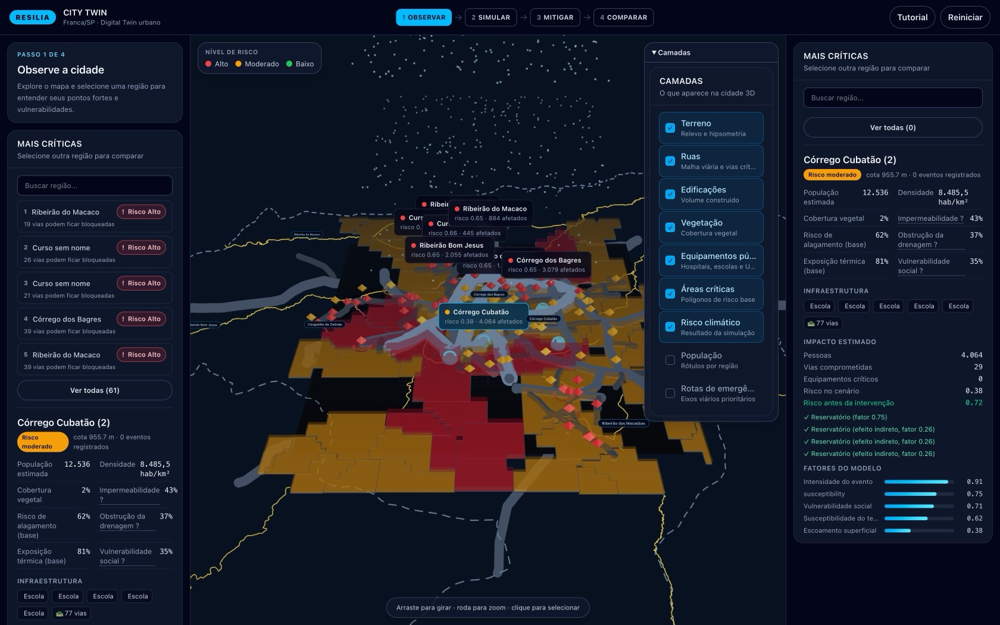
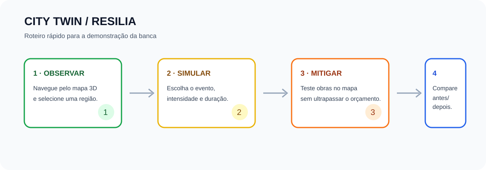

# CITY TWIN — RESILIA

Digital twin urbano para explorar a resiliência de Franca/SP diante de chuva extrema, onda de calor, granizo, ventania e queimadas de grande porte. A POC permite observar o território, simular um evento, testar intervenções e comparar estimativas antes/depois.

> **Importante:** todos os números são estimativas do modelo da POC. Não são previsões operacionais e não substituem dados oficiais, estudos hidráulicos, dimensionamento de obras ou decisões da Defesa Civil.

## Visão rápida

O produto é um monorepo com:

- **Frontend:** mapa 3D interativo, fluxo guiado em quatro etapas, seleção de regiões, risco territorial, mitigação, comparação e Urban Copilot.
- **Backend:** API FastAPI com dados geoespaciais de Franca, motor determinístico de simulação, catálogo de intervenções, otimização por orçamento e Copilot heurístico/LLM opcional.
- **Dados:** fixtures versionadas em `backend/app/data/fixtures/franca/`, carregadas em memória. Não há banco de dados ou persistência de cenários.

Fluxo da interface: **Observar → Simular → Mitigar → Comparar**.

### Roteiro rápido para a banca

Para uma demonstração de três minutos: abra a aplicação, escolha **Chuva extrema**, suba a intensidade para **95%** e a duração para **90%**, clique em **SIMULAR**, vá a **MITIGAR**, pressione **R$ 20 mi** e depois **[ OTIMIZAR POR ORÇAMENTO ]**, aplique o portfólio e siga para **COMPARAR**.

Essa combinação foi escolhida porque produz o contraste mais legível: com os parâmetros padrão (80% / 60%) **nenhuma das 61 regiões ultrapassa o limiar de risco alto** e o mapa fica quase todo âmbar. Elevar a intensidade é o que evidencia as regiões críticas. Veja a seção [Sensibilidade ao cenário](#sensibilidade-ao-cenário).

## Guia visual

As telas abaixo foram capturadas da aplicação em execução, com o Chrome e a API local no ar.

### 1. Observar — visão geral



Na carga, uma região já vem selecionada. O mapa mostra relevo, malha viária, edificações, vegetação e equipamentos públicos. Arraste para girar, use a roda para aproximar, clique para selecionar e **duplo clique** para recentralizar a câmera. No rodapé do mapa, um lembrete resume as três gestures.

### 2. Observar — ranking das mais críticas



A lista ordena as regiões pelo risco do cenário corrente, com badge colorido e uma justificativa em uma linha ("N vias podem ficar bloqueadas", "alta impermeabilidade do solo", "maior vulnerabilidade social"). Mostra as 5 primeiras, com **Ver todas (61)** para expandir, e um campo **Buscar região...** que filtra pelo nome amigável.

### 3. Simular — chuva extrema



Cinco eventos, dois parâmetros ajustáveis e quatro indicadores: **População afetada**, **Vias comprometidas**, **Equip. críticos** e **Regiões críticas**. O território recebe cores de risco e a legenda explica alto, moderado e baixo. O texto de rodapé sempre lembra que os números são estimativas do modelo.

### 4. Simular — onda de calor



A onda de calor troca a iluminação da cena (luz direcional laranja, hemisférica mais forte) e adiciona um sol pulsante sobre a região de maior risco, além de uma névoa no horizonte. Os outros três eventos usam efeitos visuais mais leves, por serem menos legíveis em 3D.

### 5. Mitigar — obras posicionadas e orçamento



Escolha o tipo de intervenção, a região e o fator de impacto, clique em **+ Adicionar intervenção** e então **clique no mapa 3D** para posicionar a obra (um anel pulsante acompanha o cursor). Cada obra tem um controle de **impacto** de 0 a 100% que pode ser ajustado depois de criada. A faixa de orçamento mostra o gasto contra o limite escolhido.

### 6. Otimizar por orçamento



O otimizador escolhe o portfólio que evita mais pessoas dentro do orçamento, e informa **por que parou** (orçamento ou número de obras), quanto sobrou e o que não coube. Cada proposta traz região, tipo, custo e pessoas evitadas.

### 7. Urban Copilot



O Copilot identifica a região de maior risco, mostra os fatores com peso, sugere uma intervenção e informa custo e efeito estimado. A aplicação **não aplica nada sem confirmação**: o botão **SIMULAR** adiciona a obra sugerida. O selo `heurístico` ou `LLM` no título do painel indica a origem da análise — na captura acima ele aparece como `heurístico`, porque a POC roda sem chave de provedor.

### 8. Comparar — antes e depois



Deltas de população, vias e equipamentos, com barras **ANTES** e **DEPOIS**, o total de pessoas evitadas e uma tabela opcional por região. A nota em âmbar explica que o efeito pode transbordar para regiões vizinhas ligadas pela mesma rede de drenagem.

### 9. Camadas do mapa



O menu **Camadas** liga e desliga nove camadas. É o controle mais direto para explicar a granularidade do modelo em uma demonstração.

### Fluxo em diagrama



### Roteiro de avaliação

1. Em **Observar**, arraste o mapa para orbitar, use a roda ou o gesto de pinça para aproximar e clique em uma região. O contorno e o painel lateral mostram o detalhe selecionado; cursos d'água nomeados aparecem apenas de forma seletiva para preservar a leitura.
2. Em **Simular**, escolha um dos cinco eventos, ajuste intensidade e duração e pressione **Simular**. O território recebe cores de risco e a legenda explica baixo, moderado e alto.
3. Em **Mitigar**, escolha uma intervenção, clique no mapa ou na região selecionada e acompanhe o orçamento. O botão do Urban Copilot sugere uma combinação explicável; a aplicação não aplica nada sem confirmação.
4. Em **Comparar**, use o controle antes/depois e leia os deltas. A tabela por região é opcional e o texto de transbordo explica quando uma obra beneficia áreas vizinhas.

Todos os painéis têm estados de carregamento, vazio e erro. O botão **Reiniciar** limpa a simulação após confirmação e **Tutorial** reabre o tour inicial.

## Stack

| Camada | Tecnologias |
| --- | --- |
| Frontend | React 19, TypeScript estrito, Vite, Tailwind CSS 4, React Three Fiber, drei, three |
| Backend | Python 3.10+, FastAPI, Pydantic v2, Uvicorn |
| Qualidade | pytest, pytest-asyncio, ruff, mypy, oxlint, TypeScript |
| Deploy local | Docker Compose, Nginx para servir o frontend |

## Requisitos

- Node.js compatível com o Vite atual e npm.
- Python 3.10 ou superior.
- Docker e Docker Compose apenas para execução conteinerizada.

## Executar localmente

### 1. Backend

```bash
cd backend
python3 -m venv .venv
.venv/bin/python -m pip install -e '.[dev]'
.venv/bin/python -m uvicorn app.main:app --reload --host 127.0.0.1 --port 8000
```

Verifique a API:

```bash
curl http://127.0.0.1:8000/api/health
# {"status":"ok"}
```

A documentação interativa fica em <http://127.0.0.1:8000/docs>.

### 2. Frontend

Em outro terminal:

```bash
cd frontend
npm ci
VITE_API_PROXY=http://127.0.0.1:8000 npm run dev
```

Acesse <http://localhost:5173>. O proxy do Vite envia `/api` para o backend.

> **Atenção ao `VITE_API_PROXY`.** O padrão em `vite.config.ts` é `http://localhost:8001`, que **não** é a porta em que o backend sobe no passo 1 (8000). Sem a variável, todas as chamadas da interface falham com `502 Bad Gateway` e a tela mostra "Não foi possível carregar a cidade". Defina `VITE_API_PROXY=http://127.0.0.1:8000` — ou corrija o padrão em `vite.config.ts` para 8000.

Use o endereço com `127.0.0.1` em vez de `localhost`: em máquinas onde `localhost` resolve primeiro para IPv6 (`::1`) e o Uvicorn escuta apenas em IPv4, o proxy falha com `502` mesmo com a porta correta.

Para usar outra porta ou host:

```bash
VITE_API_PROXY=http://127.0.0.1:8010 npm run dev
```

### Docker Compose

```bash
docker compose up --build
```

| Serviço | URL |
| --- | --- |
| Aplicação | <http://localhost:8080> |
| API | <http://localhost:8000> |
| Swagger | <http://localhost:8000/docs> |

O frontend aguarda o healthcheck do backend antes de iniciar.

## Configuração

Copie `backend/.env.example` para `backend/.env` quando precisar personalizar o ambiente. O backend carrega esse arquivo via `python-dotenv`.

| Variável | Padrão | Descrição |
| --- | --- | --- |
| `CORS_ORIGINS` | `http://localhost:5173,http://127.0.0.1:5173` | Origens permitidas pelo backend, separadas por vírgula |
| `URBAN_COPILOT_API_KEY` | vazio | Chave opcional de um provedor compatível com a API da OpenAI |
| `URBAN_COPILOT_BASE_URL` | vazio | Base URL do provedor LLM |
| `URBAN_COPILOT_MODEL` | vazio | Nome do modelo |
| `VITE_API_PROXY` | `http://localhost:8001` (em `vite.config.ts`) | Destino do proxy `/api` no desenvolvimento |
| `VITE_API_BASE_URL` | vazio | Prefixo absoluto de API no frontend; vazio usa o proxy do Vite |

Sem as três variáveis do Copilot, a aplicação usa a análise heurística offline. Falhas no provedor também retornam à heurística; a interface identifica a fonte da recomendação.

## API

Todas as rotas abaixo usam o prefixo `/api`, exceto a raiz. Os schemas completos estão em `backend/app/schemas.py` e podem ser explorados em `/docs`.

| Método | Rota | Uso |
| --- | --- | --- |
| `GET` | `/` | Identidade da API e aviso de uso (sem prefixo) |
| `GET` | `/health` | Healthcheck |
| `GET` | `/city` | Cidade, regiões, vias, cursos d’água, equipamentos, edificações, árvores, relevo e fontes |
| `GET` | `/scenarios` | Cenários disponíveis e impactos descritos |
| `GET` | `/interventions/catalogue` | Tipos de intervenção, descrição, efeitos e fator padrão |
| `GET` | `/costs/catalogue` | Hipóteses de custo publicadas pelo modelo |
| `POST` | `/simulate` | Uma simulação com zero ou mais intervenções |
| `POST` | `/compare` | Comparação de uma configuração com o baseline |
| `POST` | `/run` | Baseline, resultado mitigado, comparação e custo em uma resposta atômica |
| `POST` | `/optimize` | Portfólio de intervenções dentro de um orçamento |
| `POST` | `/copilot` | Recomendação explicável para o cenário atual |

### Exemplo de simulação

```bash
curl -s http://localhost:8000/api/simulate \
  -H 'content-type: application/json' \
  -d '{
    "scenario": {
      "type": "extreme_rain",
      "intensity": 0.8,
      "duration": 0.6
    },
    "interventions": []
  }' | python3 -m json.tool
```

`intensity`, `duration` e `impact_factor` são números entre `0` e `1`. Os tipos de cenário são `extreme_rain`, `heat_wave`, `hailstorm`, `windstorm` e `wildfire`; os tipos de intervenção estão no catálogo.

### Formato de `/api/city`

O payload inclui `regions`, `roads`, `waterways`, `facilities`, `buildings`, `trees`, `boundary`, `elevation`, `vulnerability_points` e `sources`. Cada região possui geometria, centroide, métricas ambientais/sociais, quantidade de vias e equipamentos associados.

Os cursos d’água têm `id`, `name` opcional, `kind`, `path`, `width_m` e origem. O frontend agrupa somente o nome para exibição; IDs e geometrias continuam distintos. Cada região também publica `drainage_clogging`, um índice estimado de obstrução da drenagem superficial entre `0` e `1`. Ele combina impermeabilidade, pontos documentados de vulnerabilidade, densidade viária e proximidade de cursos d'água, e agrava o risco de alagamento de forma explicável no motor.

Além dos campos consumidos pela interface, cada região também publica `slope_deg`, `elevation_min_m`, `elevation_max_m`, `waterway_proximity_m`, `building_footprint_ratio`, `landuse_coverage`, `population_is_estimated`, `vulnerability_is_estimated` e `within_municipality`. Esses campos existem para auditoria e não são todos exibidos.

## Funcionalidades por área

### Camadas do mapa 3D

Nove camadas, ligadas por padrão, exceto `População` e `Rotas de emergência`:

| Camada | Conteúdo |
| --- | --- |
| Terreno | Relevo, hipsometria e limite municipal |
| Ruas | Malha viária com espessura por hierarquia |
| Edificações | Volume construído, colorido por uso |
| Vegetação | Árvores instanciadas |
| Equipamentos públicos | Hospitais, escolas, UBS e bases de emergência |
| Áreas críticas | Polígonos de risco base (vermelho onde o alagamento é alto) |
| Risco climático | Resultado da simulação, com a paleta de alto/moderado/baixo |
| População | Rótulo de população estimada por região |
| Rotas de emergência | Eixos viários prioritários destacados em âmbar |

O relevo vem de um DEM real, com exagero vertical aplicado para leitura. Edificações, árvores e vias usam instancing, então a cena inteira se mantém leve apesar dos milhares de elementos.

### Os cinco eventos

| Evento | O que o modelo representa | Efeito na cena |
| --- | --- | --- |
| Chuva extrema | Alagamentos, bloqueio de vias, isolamento, equipamentos afetados | Chuva animada e áreas alagadas sobre as regiões de risco |
| Onda de calor | Exposição térmica, baixa cobertura vegetal, pressão sobre a saúde | Luz laranja, sol pulsante e névoa no horizonte |
| Granizo | Danos a coberturas, exposição de edificações | Tinta azul-clara na cena |
| Ventania | Queda de árvores, bloqueio de vias | Tinta verde-azulada |
| Queimada de grande porte | Vegetação seca, exposição à fumaça | Tinta vermelha |

O modelo trata cada evento com fatores próprios: chuva e calor combinam drenagem, terreno e vulnerabilidade social com pesos diferentes; granizo pondera a exposição das edificações; ventania soma a densidade de vegetação; queimada usa a biomassa seca como combustível.

### Otimização por orçamento

O otimizador roda em três fases:

1. **Baseline e triagem.** Roda o cenário sem obras, calcula uma prioridade por região e mantém as 12 mais críticas.
2. **Ganho marginal guloso.** A cada passo, mede quanto cada obra ainda evita sobre o portfólio atual, escolhe a melhor relação pessoas evitadas por real gasto, e garante no máximo uma obra por tipo e por região.
3. **Consolidação.** Roda o motor uma última vez com o portfólio inteiro para que todos os totais publicados venham de uma execução única, não de somas parciais.

O resultado informa `binding_constraint` — se parou por falta de dinheiro ou por limite de obras —, o saldo restante e até seis propostas rejeitadas por não caberem no orçamento.

Presets de orçamento na interface: **R$ 1 mi**, **R$ 5 mi**, **R$ 20 mi** e **R$ 50 mi**.

### Modelo de custo

Cada tipo de intervenção é precado por unidade física, com piso e teto:

| Tipo | Unidade | Custo unitário | Dimensionamento |
| --- | --- | --- | --- |
| Área verde | m² plantados e mantidos por 5 anos | R$ 65,00 | População afetada × 12 m² |
| Reservatório | m³ de capacidade de amortecimento | R$ 120,00 | Área × lâmina × intensidade |
| Abrigo | cama operada por 12 meses | R$ 7.400,00 | População afetada × 0,15 |
| Rota alternativa | km recapeado e sinalizado | R$ 2.900.000,00 | Vias da região ÷ 5,5 |
| Ponto de atendimento | posto com equipe e veículo por 12 meses | R$ 1.150.000,00 | População afetada ÷ 12.000 |

O preço final multiplica a unidade pelo fator de impacto e respeita piso e teto por tipo.

> **Aviso do próprio modelo:** "Custos são hipóteses de ordem de grandeza para um município brasileiro de 365 mil habitantes, não cotações. Substitua COSTS por dados do orçamento real."

### Urban Copilot

Duas fontes, uma interface:

- **Heurística offline (padrão).** Roda o motor, ordena as regiões por prioridade e escolhe a intervenção pela combinação entre o evento e o fator dominante da região. A recomendação é sempre verificável: os fatores e o peso de cada um são exibidos.
- **LLM opcional.** Com `URBAN_COPILOT_API_KEY` configurada, usa um endpoint compatível com a API da OpenAI, com resposta em JSON validado por schema.

Dois detalhes importantes para a banca:

- **A fonte da estimativa nunca é a LLM.** O `expected_effect` é sempre produced pelo motor, com a obra inserida e re-simulada, mesmo quando o texto vem do provedor. Se a LLM falhar ou responder fora do schema, a aplicação volta à heurística sem quebrar.
- **O efeito estimado é uma projeção, não uma medição.** Só o botão **SIMULAR** aplica a obra de fato.

## Dados e proveniência

O modelo territorial é construído a partir de fontes abertas e públicas, com licenças compatíveis:

| Camada | Fonte | Licença |
| --- | --- | --- |
| Limite municipal | IBGE, API de Malhas | CC-BY-SA 4.0 |
| Demografia | IBGE, Painel de Cidades | CC-BY-SA 4.0 |
| Sistema viário, edificações, uso do solo, hidrografia, equipamentos | OpenStreetMap | ODbL |
| Relevo | AWS Terrain Tiles (Terrarium sobre SRTM) | CC-BY |
| Pontos vulneráveis | Prefeitura de Franca, Plano de Contingência de Defesa Civil | Documento público municipal |

O inventário completo, com data de coleta, está em [`backend/app/data/fixtures/franca/SOURCES.md`](backend/app/data/fixtures/franca/SOURCES.md).

### O que está no pacote de dados

| Elemento | Quantidade |
| --- | --- |
| Regiões (sub-bacias) | 61 |
| Vias | 1.412 |
| Edificações | 1.390 |
| Árvores | 517 |
| Cursos d'água | 81 |
| Equipamentos públicos | 131 |
| Polígonos de uso do solo | 493 |
| Pontos de vulnerabilidade documentados | 5 |
| Malha de relevo | 256 × 288 células a 46,4 m |

**As regiões são sub-bacias hidrográficas, não bairros.** Franca não possui uma divisão territorial oficial do IBGE, então o modelo agrupa o território por drenagem: cada região é uma bacia de captação, nomeada pelo curso d'água que a drena. Isso é coerente com o fenômeno simulado (a água), mas deve ser explicado à banca: um morador não reconhece "Córrego Cubatão" como o nome do bairro em que mora.

Cada região recebe sua população por **rateio** do total do IBGE, proporcional à densidade real de edificações do OpenStreetMap — logo, `population_is_estimated` é `true` e a periferia menos densa aparece sub-representada.

### Pontos de vulnerabilidade documentados

Cinco alagamentos conhecidos, extraídos do plano municipal, alimentam o cálculo de obstrução de drenagem:

| Local | Gravidade |
| --- | --- |
| Av. Doutor Hélio Palermo / Córrego dos Bagres | 0,90 |
| Av. Dr. Ismael Alonso y Alonso / viaduto Major Nicácio (Cubatão) | 0,85 |
| Av. São Vicente (antiga Lagoa do Castelinho) | 0,80 |
| Av. Doutor Antônio Barbosa Filho (após Ponte General Teles) | 0,78 |
| Av. Adhemar Pereira de Barros (drenagem deficiente) | 0,72 |

Esses pontos chegam pela API, mas a POC ainda não os desenha no mapa — ver [Limitações](#limitações-e-bugs-conhecidos).

## Sensibilidade ao cenário

O mesmo motor produz resultados bem diferentes conforme os parâmetros. Estes números vêm de execuções reais contra a API com a cidade empacotada:

| Cenário | Intensidade / Duração | População afetada | Vias comprometidas | Regiões de risco alto |
| --- | --- | --- | --- | --- |
| Chuva extrema | 80% / 60% (padrão) | 157.547 | 705 | **0** |
| Chuva extrema | 95% / 90% | 212.390 | 952 | 26 |
| Chuva extrema | 100% / 100% | 232.410 | 1.041 | 57 |
| Onda de calor | 80% / 60% | 216.350 | — | 4 |
| Onda de calor | 100% / 100% | 319.094 | — | 59 |

O limiar de risco alto é `0,62`. Com os parâmetros padrão, **nenhuma das 61 regiões o atinge**: o mapa fica uniformemente âmbar e um avaliador rápido pode concluir que o produto "não faz nada". É por isso que o roteiro de demonstração começa em 95% / 90%.

Este comportamento também é uma leitura correta do modelo: a suscetibilidade tem um piso de `0,45` e é combinado com o multiplicador do perigo, então eventos moderados ainda contam história. É o limiar fixo, e não o modelo, que comprime a leitura.

## Reproduzindo os números da demonstração

```bash
# Portfólio dentro de R$ 20 milhões
curl -s http://localhost:8000/api/optimize \
  -H 'content-type: application/json' \
  -d '{"scenario":{"type":"extreme_rain","intensity":0.95,"duration":0.9},"budget_brl":20000000}' \
  | python3 -m json.tool

# Prioridade do Copilot (roda sem chave de LLM)
curl -s http://localhost:8000/api/copilot \
  -H 'content-type: application/json' \
  -d '{"scenario":{"type":"extreme_rain","intensity":0.95,"duration":0.9},"interventions":[],"budget_brl":20000000}' \
  | python3 -m json.tool
```

A primeira chamada responde, com a cidade empacotada, com **5 reservatórios em 5 regiões**, **R$ 16,2 milhões** comprometidos e **65.582 pessoas evitadas** — limitado por número de obras, com R$ 3,8 milhões restantes.

## Desenvolvimento e qualidade

Backend:

```bash
cd backend
.venv/bin/python -m pytest -q
.venv/bin/ruff check .
.venv/bin/ruff format --check .
.venv/bin/mypy --explicit-package-bases app
```

Frontend:

```bash
cd frontend
npm run typecheck
npm run lint
npm run build
npm run preview
```

A suíte do backend tem **82 testes** cobrindo o motor, os catálogos, o otimizador, o Copilot e as rotas. No CI (`.github/workflows/`) o mesmo conjunto roda em Python 3.12, com `ruff`, `mypy` e `actionlint`; as imagens de backend e frontend são publicadas no GHCR e um smoke test sobe a stack publicada para validar o healthcheck.

Para validar a integração manualmente, suba backend e frontend e percorra: selecionar região → simular → adicionar intervenção → re-simular → comparar.

## Estrutura do repositório

```text
backend/
  app/
    api/routes.py             rotas REST
    schemas.py                contratos Pydantic da API
    ai/copilot.py             heurística e LLM opcional
    data/                     cidade e fixtures geoespaciais
      franca.py               montagem da cidade a partir das fixtures
      geo.py                  geodesia e geometria planar
    engine/                   simulação, custos, intervenções e otimização
    main.py                   FastAPI, CORS e configuração
  scripts/                    coleta e preparação dos dados
  tests/                      testes do motor e da API
  Dockerfile
  pyproject.toml

frontend/
  src/
    App.tsx                   shell, etapas, tutorial e layout
    components/               mapa 3D, geometria e componentes UI
    panels/                   conteúdo contextual das etapas
    state/                    reducer e hook useCityTwin
    lib/                      API, geometria, tema e formatação
  Dockerfile
  vite.config.ts
  README.md

docs/
  visual-guide.svg            diagrama do fluxo
  screenshots/                telas da aplicação em execução
```

## Limitações e bugs conhecidos

Esta seção é deliberadamente específica: os itens marcados abaixo foram observados nesta revisão, executando a POC localmente. Uma banca valoriza mais reconhecer um defeito do que descobrir um depois de uma pergunta.

### Correções rápidas de configuração

- **`VITE_API_PROXY` com padrão 8001.** `frontend/vite.config.ts:12` aponta para `http://localhost:8001`, enquanto o backend documentado roda em 8000. Sem a variável, a interface inteira falha com `502` e mostra "Não foi possível carregar a cidade". Esta é a primeira coisa a checar se a POC não subir.
- **`localhost` versus `127.0.0.1`.** O Uvicorn escuta em IPv4; em sistemas onde `localhost` resolve para `::1` primeiro, o proxy do Vite falha. Prefira o endereço numérico.

### Defeitos de interface confirmados em execução

- **Sobreposição de rótulos.** Os rótulos de região do mapa 3D são posicionados com `z-index` na casa dos milhões (biblioteca de rótulos HTML sobre o canvas). Isso faz com que eles **interceptem cliques destinados aos painéis laterais**, chegando a bloquear botões das etapas. Em uso manual com o mouse, o sintoma é um botão que "não responde"; em automação, o clique é simplesmente perdido. Afeta principalmente os painéis sobrepostos ao canvas.
- **Posicionamento de obra pouco tolerante.** O plano invisível de posicionamento cobre uma área limitada em torno da origem. Cliques fora dela não posicionam nada e **não dão qualquer retorno** — a interface permanece armada como se esperasse um clique. Durante a preparação das capturas, apenas 1 de 16 pontos testados na malha da tela aceitou a obra. Um contorno visual mais generoso ou um aviso de "clique dentro da área válida" tornaria a etapa mais previsível.
- **Alertas de console do React.** A navegação pela POC emite "two children with the same key" e avisos de desmontamento de raiz durante a renderização. Não quebram a aplicação, mas indicam listas que precisam de chave única e um ciclo de vida de limpeza.
- **Fator sem tradução.** O painel de fatores do modelo traduz dez chaves para português, mas chaves como `susceptibility` e `risk` passam em inglês puro na interface.
- **Barras da comparação compartilham escala.** Os três grupos (população, vias, equipamentos) usam um único valor máximo, calculado a partir da população. Como a população afetada é da ordem das centenas de milhares e as vias de centenas, as barras de vias e equipamentos ficam visualmente ínfimas perto de 2% de largura, embora a variação percentual seja relevante. Cada grupo deveria ter a própria escala.
- **Controle antes/depois é decorativo.** O slider destaca um dos dois cartões, mas **não faz um wipe ou qualquer transição visual na imagem do mapa**. A comparação dos números é real; a comparação visual, não.
- **Custo só atualiza após re-simular.** O valor gasto no orçamento vem da última resposta de `/api/run`. Mover o slider de impacto de uma obra ou adicionar e remover intervenções não recalcula a faixa até o usuário apertar **COMPARAR COM INTERVENÇÕES**.
- **Região com nome genérico.** As sub-bacias sem nome próprio aparecem como "Curso d'água sem nome", "… (2)", "… (15)". É tecnicamente correto e honesto, mas polui o ranking; um identificador mais estável ajudaria a leitura.

### Limitações de escopo

- A cidade é baseada nos fixtures de Franca/SP e carregada em memória; não há persistência nem autenticação.
- O motor é determinístico e usa heurísticas para risco, vizinhança, custos e propagação de efeitos; **não é um modelo hidráulico ou climático operacional**. Não substitui estudo de dimensionamento.
- **Apenas 32,4% da área do município é modelada** — a janela urbana cobre a área urbanizada, não o território inteiro. Regiões afetadas que caem fora do município são marcadas com `within_municipality: false` em vez de recortadas.
- **A população é estimada por rateio**, proporcional à densidade de edificações do OSM, e não por setor censitário. A vulnerabilidade social é um **proxy pela densidade do tecido urbano**, não por renda ou por indicador de vulnerabilidade oficial.
- A impermeabilidade usa **extensão de via por km²** como proxy de área impermeabilizada.
- Os **pontos de vulnerabilidade documentados não são desenhados no mapa**. Eles influenciam o cálculo, mas a banca não consegue vê-los, o que pode gerar a pergunta "por que a Av. São Vicente está entre as mais críticas e não aparece marcada?". Desenhar esses cinco pontos como marcadores seria uma evolução barata e de alto impacto na demonstração.
- A geometria 3D é otimizada com instancing em camadas repetitivas. Os cursos d'água são renderizados como linhas leves; uma fita de água animada é uma evolução futura.
- Granizo, ventania e queimada usam efeitos visuais leves em 3D; o detalhamento é maior para chuva e calor.
- **A pergunta do usuário não altera a análise heurística.** No modo offline, o Copilot sempre avalia o cenário e responde sobre ele; a pergunta é usada de fato apenas quando há LLM configurada.
- O banco de dados e PostGIS foram deliberadamente adiados. A próxima evolução natural é substituir o carregamento integral por consultas e versionamento de dados geoespaciais.
- **Código morto identificado na revisão:** o componente `MetricBar` não é usado em lugar nenhum, assim como `sortRegionsByName` e `regionCentre` em `lib/geo.ts`, e o campo `baseline` no estado do reducer é escrito mas nunca lido.

## Decisões de projeto

- **Fluxo em quatro etapas em vez de painel único.** A ordem observar → simular → mitigar → comparar obriga a banca a passar pela leitura do território antes de ver um número. Um painel único permitiria pular direto para o resultado e perder o argumento.
- **A IA propõe, o motor mede.** O Copilot nunca injeta um número próprio: ele escolhe uma intervenção, e o motor re-executa para dizer o que acontece. É o que permite rodar a POC sem chave de API e ainda assim defender os números.
- **O custo é declarado como hipótese.** Em vez de esconder a falta de dados de orçamento, o modelo publica unidade, piso, teto e um aviso explícito de que são ordens de grandeza.
- **Dados geodésicos, renderização planar.** A cidade é armazenada em WGS84 e desenhada em um plano métrico local; o `crs` e a `reference_scale_m` são publicados na API para que nenhum cliente precise inferir essa conversão.
- **Uploads e persistência fora do escopo.** Não há envio de dados nem histórico de cenários. A POC roda com o território empacotado em memória, o que a torna determinística e reproduzível em uma apresentação.